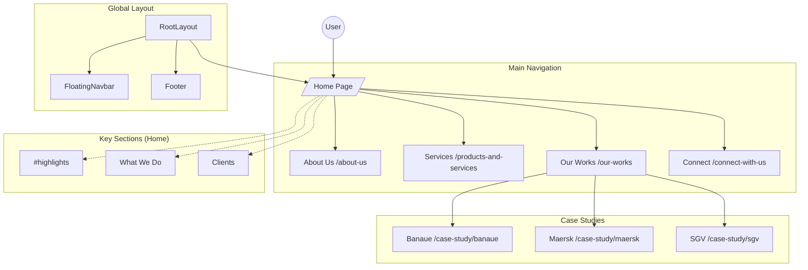

# Site Architecture

## Flowchart

## Route Structure

The application uses the Next.js App Router.

- **`app/`**: Root of the application routes.
  - **`page.tsx`**: The main landing page (Home).
  - **`layout.tsx`**: The root layout wrapping all pages. Includes global styles, fonts, and metadata.
  - **`about-us/`**: Route for the "About Us" page.
  - **`products-and-services/`**: Route for the "Services" page.
  - **`our-works/`**: Route for the portfolio listing page.
  - **`connect-with-us/`**: Route for the contact page.
  - **`case-study/`**: Dynamic or static sub-routes for individual project details.
    - **`banaue/`**: Specific case study.
    - **`maersk/`**: Specific case study.
    - **`sgv/`**: Specific case study.
  - **`api/`**: API routes (if any).

## Global Components

These components appear across multiple pages or handle global concerns.

- **`FloatingNavbar`** (`components/floating-navbar.tsx`): A persistent top navigation bar that floats above content.
- **`Footer`** (`components/footer.tsx`): The global site footer containing links and contact info.
- **`PageTransition`** (`components/page-transition.tsx`): Handles smooth transitions between route changes.
